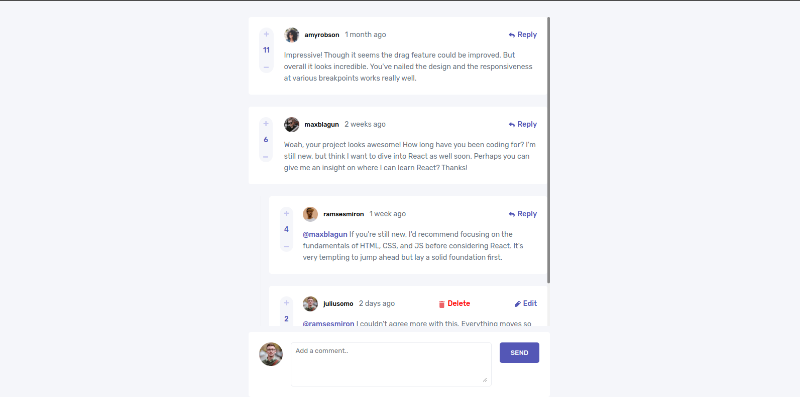

# Frontend Mentor - Interactive comments section solution

This is a solution to the [Interactive comments section challenge on Frontend Mentor](https://www.frontendmentor.io/challenges/interactive-comments-section-iG1RugEG9). Frontend Mentor challenges help you improve your coding skills by building realistic projects. 

## Table of contents

- [Overview](#overview)
  - [The challenge](#the-challenge)
  - [Screenshot](#screenshot)
  - [Links](#links)
- [My process](#my-process)
  - [Built with](#built-with)
  - [What I learned](#what-i-learned)
  - [Continued development](#continued-development)
- [Author](#author)

**Note: Delete this note and update the table of contents based on what sections you keep.**

## Overview
The challenge was to create a comment section that has edit,delete,comment and reply functionalities
### The challenge

Users should be able to:

- View the optimal layout for the app depending on their device's screen size
- See hover states for all interactive elements on the page
- Create, Read, Update, and Delete comments and replies
- Upvote and downvote comments
- **Bonus**: If you're building a purely front-end project, use `localStorage` to save the current state in the browser that persists when the browser is refreshed.
- **Bonus**: Instead of using the `createdAt` strings from the `data.json` file, try using timestamps and dynamically track the time since the comment or reply was posted.

### Screenshot




### Links

- Solution URL: [Solution](https://github.com/Taku-chimanaz/interactive-comments-section-solution)
- Live Site URL: [Live](https://interactive-comments-solution.netlify.app/)

## My process
- I implented the desktop view first and then the mobile view
### Built with

- Semantic HTML5 markup
- CSS positioning
- Flexbox
- CSS Grid
- Mobile-first workflow
- [React](https://reactjs.org/) - JS library


### What I learned


To see how you can add code snippets, see below:

```js
export const calculateDate = (commentDate) => {

    const commentJSDate = new Date(commentDate).getTime();
    const currentDate = new Date().getTime();

    const timeDifference = currentDate - commentJSDate;
    const seconds = Math.floor(timeDifference / (1000));
    const minutes = Math.floor(timeDifference / (1000 * 60));
    const daysDifference = Math.floor(timeDifference / (1000 * 60 * 60 * 24));

    if (daysDifference >= 1 && daysDifference <= 29) {
        return `${daysDifference} ago`
    } else if (daysDifference > 29) {
        const months = Math.floor(daysDifference / 30);
        return `${months} ${months > 1 ? 'months' : 'month'} ago`
    } else {
        return `${seconds > 60 ? `${minutes} minutes ago` : `${seconds} seconds ago`}`
    }
}

// sorting

export const arrangeComments = (comment) => {

    const sortedComment = comment.sort((a, b) => { return b.score - a.score });
    return sortedComment;
}


```

### Continued development

- working with css positioning
- learning more about javascript array methods


## Author

- Frontend Mentor - [@Taku-chimanaz](https://www.frontendmentor.io/profile/Taku-chimanaz)
- Twitter - [@tk_cypher](https://www.twitter.com/tk_cypher)
